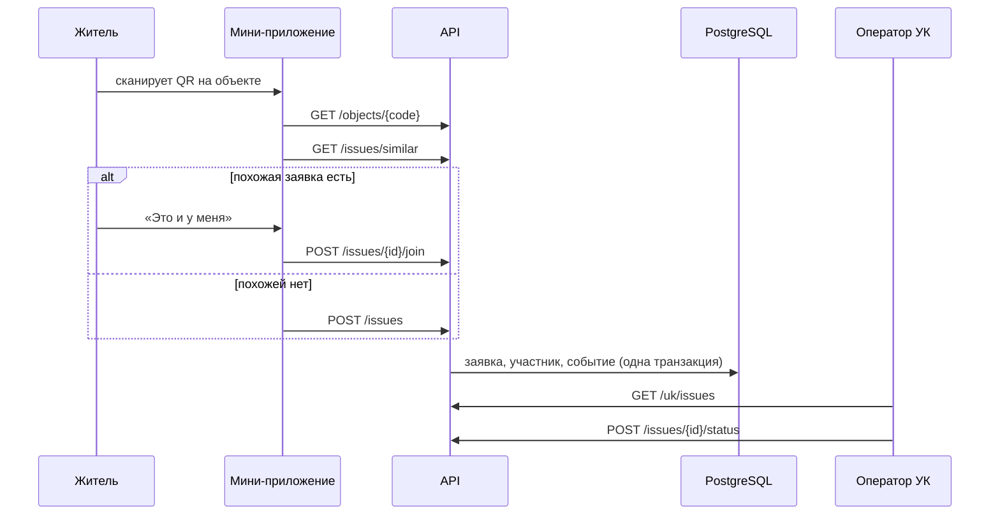

# Архитектура

Сервис состоит из бэкенда на Go, мини-приложения MAX и чат-бота. Бэкенд один: он отдаёт HTTP API мини-приложению, принимает события бота и хранит данные в PostgreSQL.

## Компоненты

| Компонент | Технологии | Назначение |
|---|---|---|
| `backend/` | Go 1.27, Fiber v3, pgx, sqlc, goose | API, бот, бизнес-правила заявок |
| `miniapp/` | Vite, React, TypeScript, MAX UI, MAX Bridge | интерфейс жителя и сотрудника УК |
| PostgreSQL 18 | | дома, заявки, участники, журнал событий |
| Caddy | | HTTPS, раздача мини-приложения, прокси `/api` и `/webhook` |

## Слои бэкенда

```
cmd/api             сборка зависимостей и запуск
internal/domain     правила предметной области, без внешних зависимостей
internal/app        сценарии и интерфейсы хранилища
internal/transport  входящие запросы: HTTP API, события бота
internal/storage    PostgreSQL и клиент MAX Bot API
```

- `domain` ни от чего не зависит.
- `app` зависит только от `domain`.
- `transport` и `storage` зависят от `app` и `domain`.
- Собирает всё вместе только `cmd/api`.

### Домен

- **Заявка (`issue`)** — главный объект. Хранит статус и допустимые переходы, список участников, срок ответа. При каждом изменении записывает событие: создана, присоединился житель, сменился статус.
- **Справочник категорий (`rules`)** — для каждой категории задаёт ответственного, основание и срок в рабочих днях. Для другого региона меняется справочник, а не код.
- **Пользователь (`user`)** — житель или оператор УК, согласие на обработку персональных данных, удаление аккаунта с обезличиванием.
- **Дом (`house`)** — дом, подъезды, объекты общего имущества с QR-кодами, управляющая организация.

### Сценарии

- **Сообщить о проблеме:** категория берётся из объекта с QR-кодом или из выбора жителя. Ответственный — УК дома, срок считается по справочнику в рабочих днях по московскому времени.
- **«Это и у меня»:** житель присоединяется к открытой заявке вместо создания дубля. Повторное присоединение отклоняется.
- **Похожие заявки:** перед созданием новой показываются открытые заявки того же дома и категории за 14 дней.
- **Смена статуса:** доступна только оператору УК, которая отвечает за заявку. Отказ требует причину.
- **Очередь УК:** открытые заявки по сроку, просроченные первыми, затем закрытые.

Изменение заявки выполняется в одной транзакции: блокировка строки, проверка правил, сохранение состояния, новых участников и событий.

## Поток заявки



## Мини-приложение

`miniapp/` — Vite, React 19, TypeScript в строгом режиме, компоненты MAX UI и фирменный слой «Адресная табличка» (эмаль, таблички, штамп статуса, шкала срока).

| Экран | Что делает |
|---|---|
| Мой дом | табличка дома, факты, УК с кнопкой звонка в диспетчерскую, открытые проблемы дома, мои заявки |
| Новая заявка | три шага: описание (категория, место, текст), проверка на дубль, отправка с согласием |
| Об этом уже сообщили | похожая открытая заявка и кнопка «Это и у меня» вместо дубля |
| Заявка | номер, штамп статуса, число сообщивших, шкала срока, ответственный и основание, хронология, шеринг в чат дома |
| Кабинет УК: заявки | сводка (просрочено, срок сегодня, всего открыто) и заявки по срочности |
| Кабинет УК: наклейки | выбор дома и объекта, наклейка с QR-кодом по холсту (A6, всегда светлая), печать из браузера |
| Кабинет УК: метрики | первый ответ жителю по дням и в сравнении с прошлой неделей, сколько сообщений соседей приходится на одну проблему, доля закрытых в срок |
| Смена статуса | нижний лист с допустимыми статусами; для отказа нужна причина |

- **Вход.** Внутри MAX приложение отправляет `initData` на `POST /api/v1/auth/max`. В браузере доступен демо-вход по ролям, в том числе по ссылке `?demo=resident|resident_2|uk`.
- **Параметр запуска.** `i_<id>` открывает заявку, `o_<код>` — форму по QR-коду объекта, `n_<категория>` — форму с выбранной категорией.
- **QR-наклейки.**
  - QR ведёт на `https://max.ru/<бот>?startapp=o_<код объекта>`: житель сканирует его камерой телефона, и в MAX открывается форма с уже выбранными домом, подъездом и объектом.
  - Код генерируется в браузере библиотекой `uqr` (MIT, без зависимостей).
  - Параметр проверяется на ограничения MAX: не длиннее 512 символов, только `A-Z a-z 0-9 _ -`.
- В API есть `GET /uk/houses`: дома своей УК, только для сотрудника УК.
- **Навигация.** Экраны складываются в стек, «Назад» — нативная кнопка клиента MAX.
- **Возможности MAX Bridge с запасными путями:**
  - шеринг через `shareMaxContent`, в браузере — ссылка `max.ru/:share`;
  - сканер QR показывается только в мобильном клиенте.
- **Тема.** Светлая и тёмная следуют системной настройке.

## Живая карточка

- **Когда отправляется.** Каждый участник заявки получает в чат с ботом сообщение-карточку: номер, что и где, статус, ответственный, срок, сколько соседей сообщили, комментарий УК, кнопки «Открыть заявку» и «Поделиться». При изменении заявки то же сообщение редактируется (`PUT /messages`). При закрытии заявки участникам приходит отдельное итоговое сообщение.
- **Просрочка.**
  - Фоновая задача проверяет открытые заявки при старте и затем каждые 10 минут.
  - Если срок ответа прошёл, заявка один раз получает отметку `overdue_at`, а в хронологию добавляется событие «Срок ответа истёк».
  - Участникам обновляется карточка («Срок: истёк …») и приходит отдельное сообщение. В нём сказано, до какой даты УК должна была ответить и что можно обратиться в Мосжилинспекцию.
  - Задача работает при любом `BOT_MODE`. Если бот выключен, уведомления ждут в очереди.
- **Очередь (outbox).**
  - Уведомления записываются в таблицу `outbox` в той же транзакции, что и изменение заявки: изменение не потеряется, даже если MAX недоступен.
  - В очереди хранится только адресат. Текст карточки собирается при отправке из актуального состояния заявки, поэтому серия быстрых изменений схлопывается в одну правку.
- **Фоновая отправка.**
  - Лимиты Bot API: 30 запросов в секунду всего и 2 в секунду на чат.
  - Неудачные попытки повторяются с нарастающей паузой.
  - При ответе 429 отправка притормаживает.
- **Кому.** Уведомляются только участники заявки, массовых рассылок нет.

## Бот

Режим задаётся переменной `BOT_MODE`:

| Режим | Когда | Как работает |
|---|---|---|
| `webhook` | сервер | при старте регистрирует `https://<DOMAIN>/webhook/max`; события приходят POST-запросами |
| `polling` | разработка | бот сам опрашивает `GET /updates` |
| `off` | разработка API | бот не запускается |

Webhook проверяет секрет из заголовка `X-Max-Bot-Api-Secret`, отвечает 200 сразу и обрабатывает событие в фоне. MAX может доставить событие повторно, поэтому ключ каждого события сохраняется в таблице `processed_updates` и повтор пропускается.

Бот отвечает только в личных диалогах и не пишет в групповые чаты.

Диалог заявки:

1. **Дом.** Если дом не выбран, бот просит геопозицию и показывает три ближайших дома кнопками или предлагает найти дом в приложении.
2. **Категория.** Житель пишет, что сломалось. Бот определяет категорию по ключевым словам.
3. **Похожая заявка.** Если в доме уже есть открытая заявка той же категории, бот предлагает «Это и у меня».
4. **Подтверждение.** Иначе бот показывает, как понял проблему, кто отвечает и до какого срока. Кнопки «Отправить» и «Изменить».
5. **Согласие.** Перед первой заявкой бот запрашивает согласие на обработку данных.
6. **Форма.** Если текст длинный или категория не определилась, бот открывает форму мини-приложения.

Состояние диалога хранится в самих кнопках, поэтому бот не держит черновиков и переживает перезапуск. Команды меню: `/new`, `/my`, `/house`, `/help`.

## Вход

- **Мини-приложение** передаёт строку `initData`. Сервер проверяет подпись HMAC-SHA256 на токене бота и свежесть `auth_date` (не старше часа), затем выдаёт собственный токен сессии на 12 часов.
- **Демо-вход** (`POST /api/v1/auth/demo`) нужен для проверки API без клиента MAX. Включается переменной `DEMO_AUTH_ENABLED=true` только на демо-стенде.

## Данные

- Схема и демонстрационные данные создаются миграциями при старте сервиса (`internal/storage/postgres/migrations`).
- Модельные записи помечены `source = 'model'`, подробности — в [data.md](data.md).
- Соседи видят только число участников заявки, имена и телефоны не раскрываются.
