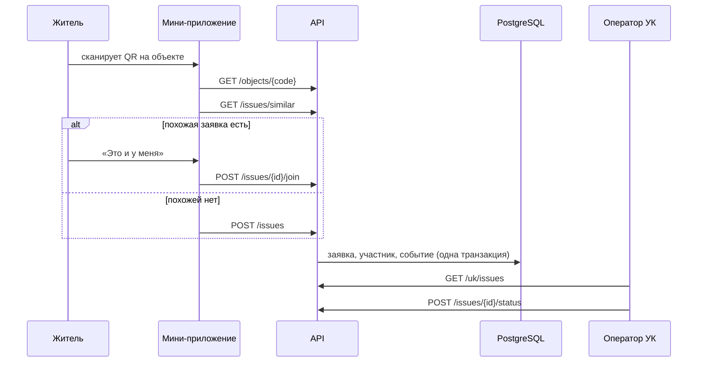

# Архитектура

Сервис состоит из бэкенда на Go, мини-приложения MAX и чат-бота. Бэкенд один: он отдаёт HTTP API мини-приложению, принимает события бота и хранит данные в PostgreSQL.

## Компоненты

| Компонент | Технологии | Назначение |
|---|---|---|
| `backend/` | Go 1.27, Fiber v3, pgx, sqlc, goose | API, бот, бизнес-правила заявок |
| `miniapp/` | Vite, React, TypeScript, MAX UI, MAX Bridge | интерфейс жителя и сотрудника УК |
| PostgreSQL 18 | | дома, заявки, участники, журнал событий |
| MinIO | S3 API | фото к заявкам |
| Caddy | | HTTPS, раздача мини-приложения, прокси `/api` и `/webhook` |

## Слои бэкенда

```
cmd/api             сборка зависимостей и запуск
internal/domain     правила предметной области, без внешних зависимостей
internal/app        сценарии и интерфейсы хранилища
internal/transport  входящие запросы: HTTP API, события бота
internal/storage    PostgreSQL и клиент MAX Bot API
```

- `domain` ни от чего не зависит.
- `app` зависит только от `domain`.
- `transport` и `storage` зависят от `app` и `domain`.
- Собирает всё вместе только `cmd/api`.

### Домен

- **Заявка (`issue`)** — главный объект. Хранит статус и допустимые переходы, список участников, срок ответа. При каждом изменении записывает событие: создана, присоединился житель, сменился статус.
- **Справочник категорий (`rules`)** — для каждой категории задаёт ответственного, основание и срок в рабочих днях. Для другого региона меняется справочник, а не код.
- **Пользователь (`user`)** — житель или оператор УК, согласие на обработку персональных данных, удаление аккаунта с обезличиванием.
- **Дом (`house`)** — дом, подъезды, объекты общего имущества с QR-кодами, управляющая организация.

### Сценарии

- **Сообщить о проблеме:** категория берётся из объекта с QR-кодом или из выбора жителя. Ответственный — УК дома, срок считается по справочнику в рабочих днях по московскому времени.
- **«Это и у меня»:** житель присоединяется к открытой заявке вместо создания дубля. Повторное присоединение отклоняется.
- **Похожие заявки:** перед созданием новой показываются открытые заявки того же дома и категории за 14 дней.
- **Смена статуса:** доступна только оператору УК, которая отвечает за заявку. Отказ требует причину.
- **Очередь УК:** открытые заявки по сроку, просроченные первыми, затем закрытые.

Изменение заявки выполняется в одной транзакции: блокировка строки, проверка правил, сохранение состояния, новых участников и событий.

## Поток заявки



## Мини-приложение

`miniapp/` — Vite, React 19, TypeScript в строгом режиме, компоненты MAX UI и фирменный слой «Адресная табличка» (эмаль, таблички, штамп статуса, шкала срока).

| Экран | Что делает |
|---|---|
| Мой дом | табличка дома, факты, УК с кнопкой звонка в диспетчерскую, открытые проблемы дома, мои заявки |
| Новая заявка | три шага: описание (категория, место, текст), проверка на дубль, отправка с согласием |
| Об этом уже сообщили | похожая открытая заявка и кнопка «Это и у меня» вместо дубля |
| Заявка | номер, штамп статуса, число сообщивших, шкала срока, ответственный и основание, хронология, шеринг в чат дома |
| Кабинет УК: заявки | сводка (просрочено, срок сегодня, всего открыто) и заявки по срочности |
| Кабинет УК: наклейки | выбор дома и объекта, наклейка с QR-кодом по холсту (A6, всегда светлая), печать из браузера |
| Кабинет УК: метрики | первый ответ жителю по дням и в сравнении с прошлой неделей, сколько сообщений соседей приходится на одну проблему, доля закрытых в срок |
| Смена статуса | нижний лист с допустимыми статусами; для отказа нужна причина |

- **Вход.** Внутри MAX приложение отправляет `initData` на `POST /api/v1/auth/max`. В браузере доступен демо-вход по ролям, в том числе по ссылке `?demo=resident|resident_2|uk`.
- **Параметр запуска.** `i_<id>` открывает заявку, `o_<код>` — форму по QR-коду объекта, `n_<категория>` — форму с выбранной категорией.
- **QR-наклейки.**
  - QR ведёт на `https://max.ru/<бот>?startapp=o_<код объекта>`: житель сканирует его камерой телефона, и в MAX открывается форма с уже выбранными домом, подъездом и объектом.
  - Код генерируется в браузере библиотекой `uqr` (MIT, без зависимостей).
  - Параметр проверяется на ограничения MAX: не длиннее 512 символов, только `A-Z a-z 0-9 _ -`.
- В API есть `GET /uk/houses`: дома своей УК, только для сотрудника УК.
- **Навигация.** Экраны складываются в стек, «Назад» — нативная кнопка клиента MAX.
- **Возможности MAX Bridge с запасными путями:**
  - шеринг через `shareMaxContent`, в браузере — ссылка `max.ru/:share`;
  - сканер QR показывается только в мобильном клиенте;
  - телефон для мастера через `requestContact`, в браузере вместо кнопки подсказка (раздел «Телефон для мастера»).
- **Тема.** Светлая и тёмная следуют системной настройке.

## Живая карточка

- **Когда отправляется.** Каждый участник заявки получает в чат с ботом сообщение-карточку: номер, что и где, статус, ответственный, срок, сколько соседей сообщили, комментарий УК, кнопки «Открыть заявку» и «Поделиться». При изменении заявки то же сообщение редактируется (`PUT /messages`). При закрытии заявки участникам приходит отдельное итоговое сообщение.
- **Просрочка.**
  - Фоновая задача проверяет открытые заявки при старте и затем каждые 10 минут.
  - Если срок ответа прошёл, заявка один раз получает отметку `overdue_at`, а в хронологию добавляется событие «Срок ответа истёк».
  - Участникам обновляется карточка («Срок: истёк …») и приходит отдельное сообщение. В нём сказано, до какой даты УК должна была ответить и что можно обратиться в Мосжилинспекцию.
  - Задача работает при любом `BOT_MODE`. Если бот выключен, уведомления ждут в очереди.
- **Обращение в жилинспекцию.** У просроченной открытой заявки её участник видит кнопку «Подготовить обращение».
  - `POST /issues/{id}/appeal` проверяет права и выдаёт ссылку с HMAC-подписью, она действует 10 минут.
  - По ссылке `GET /appeal/{token}` сервер собирает PDF: адресат (Мосжилинспекция), адрес дома, УК, дата подачи, срок и его основание, число сообщивших, хронология без имён, просьба провести проверку.
  - ФИО, квартиру, телефон и подпись житель вписывает сам: персональные данные в файл не попадают.
  - Заголовок авторизации ссылке не нужен: в MAX файл скачивается через `WebApp.downloadFile`, который заголовков не передаёт. В браузере работает обычная ссылка с `download`.
  - PDF собирается библиотекой `signintech/gopdf` (MIT) со шрифтом Go (BSD). Шрифт встроен в бинарник, с кириллицей.
- **Очередь (outbox).**
  - Уведомления записываются в таблицу `outbox` в той же транзакции, что и изменение заявки: изменение не потеряется, даже если MAX недоступен.
  - В очереди хранится только адресат. Текст карточки собирается при отправке из актуального состояния заявки, поэтому серия быстрых изменений схлопывается в одну правку.
- **Фоновая отправка.**
  - Лимиты Bot API: 30 запросов в секунду всего и 2 в секунду на чат.
  - Неудачные попытки повторяются с нарастающей паузой.
  - При ответе 429 отправка притормаживает.
- **Кому.** Уведомляются только участники заявки, массовых рассылок нет.

## Проверка ремонта жителями

- **Кто и когда.** Отметку «выполнено» ставит УК, а проверяют её жители, участники заявки: в течение 7 дней каждый может один раз ответить «Починили» или «Не починили». Сотрудник УК и район участниками заявок не становятся: сообщать, присоединяться и отвечать может только житель, иначе УК подтверждала бы свои ремонты сама.
- **Комментарий «не починили»** обязателен, до 1000 символов. Он появляется в хронологии заявки без имени автора.
- **Где ответить:**
  - в итоговом сообщении бота: «Починили» — кнопка прямо в сообщении, «Не починили» открывает карточку;
  - в карточке мини-приложения: блок «Проверьте ремонт».
- **«Починили».** Ответ сохраняется в таблице `issue_confirmations`. Уведомлений нет, чтобы не было лишних сообщений от каждого соседа. В карточке растёт число «подтвердили ремонт», в хронологии появляется строка.
- **«Не починили».** Нужен комментарий: что осталось не так.
  - Заявка возвращается в статус «В работе».
  - Срок ответа считается заново по справочнику, отметка просрочки сбрасывается.
  - Соседям приходит сообщение «Заявка снова в работе», карточки обновляются. У УК заявка стоит в группе «Вернули жители» сразу после просроченных.
- **Круги ответов.** Каждый ответ привязан к конкретной отметке «выполнено» (`done_at`). После нового «выполнено» жители отвечают заново.
- **Метрики УК:** «ремонтов подтвердили жители» среди выполненных за 30 дней и «заявок вернули в работу».

## Кабинет района

- **Кто.** Управа района или жилинспекция, роль `district` с полем `users.district`. Кабинет только для чтения.
- **Сравнение УК** (`GET /district/metrics`). По каждой УК, у которой есть дома в районе:
  - открыто и просрочено сейчас;
  - доля закрытых в срок за 30 дней;
  - первый ответ, медиана за 7 дней;
  - сколько ремонтов подтвердили жители и сколько заявок вернули.

  Сначала УК с просрочкой. Счётчики те же, что в метриках кабинета УК. УК считается целиком, со всеми своими домами.
- **Просрочено в районе** (`GET /district/overdue`): открытые заявки домов района с истёкшим сроком, самые давние первыми. Из списка открывается карточка заявки без кнопок действий: статус район не меняет, фото и контакты жителей не видит.

## Совет дома

Председатель совета дома собирает идеи соседей и спрашивает мнение дома. Председатель остаётся жителем: он сообщает о проблемах и голосует как все.

- **Предложения.** Житель пишет предложение председателю своего дома (от 10 до 1000 символов, нужно согласие на обработку данных).
  - Председатель видит папку предложений без имён авторов: текст, дату и статус. Новые стоят первыми.
  - Председатель отвечает один раз: «Взять в работу» (ответ по желанию) или «Отклонить» (ответ обязателен). Автор видит ответ в «Моих предложениях».
- **Опросы.** Председатель выносит предложение на опрос: вопрос и от 2 до 5 вариантов, опрос идёт 7 дней.
  - Голосуют жители дома, один голос на жителя, переголосовать нельзя. Итоги жителю видны после голоса или после окончания опроса, проценты в сумме дают 100.
  - Опрос без юридической силы: он не заменяет общее собрание собственников. Это написано в карточке опроса.
- **Роли.** Председатель — житель с отметкой `users.chairman_house_id`. Назначается миграцией или администратором базы, интерфейса назначения нет. УК и управа района в предложениях и опросах не участвуют.

## Телефон для мастера

- **Зачем.** Мастеру бывает нужно попасть в квартиру или уточнить детали. Житель может оставить телефон, и УК увидит его в карточках заявок, где он участник.
- **Как житель оставляет номер.** В карточке своей открытой заявки он нажимает «Оставить телефон для мастера». Кнопка есть только внутри MAX: номер отдаёт клиент MAX (`WebApp.requestContact`) вместе с подписью.
- **Проверка на сервере** (`POST /me/phone`):
  - `hash = HMAC_SHA256("authDate=…\nphone=…\nuserId=…", токен бота)`, номер без «+»;
  - подпись не старше часа;
  - `userId` — аккаунт MAX того, кто вошёл, поэтому чужой номер подставить нельзя.
- **Кто видит.** Только сотрудник ответственной УК, в блоке «Контакты жителей» карточки, и только пока заявка открыта. Соседи, чужая УК, район и списки заявок номер не получают. В ответах о себе (`/me`) номер тоже не отдаётся, только признак `phone_shared`.
- **Согласие.** Оставленный номер и есть согласие показывать его УК. «Не показывать телефон» (`DELETE /me/phone`) стирает номер: кнопка есть в карточке любой своей заявки, в том числе закрытой. Удаление аккаунта тоже стирает номер.

## Бот

Режим задаётся переменной `BOT_MODE`:

| Режим | Когда | Как работает |
|---|---|---|
| `webhook` | сервер | при старте регистрирует `https://<DOMAIN>/webhook/max`; события приходят POST-запросами |
| `polling` | разработка | бот сам опрашивает `GET /updates` |
| `off` | разработка API | бот не запускается |

Webhook проверяет секрет из заголовка `X-Max-Bot-Api-Secret`, отвечает 200 сразу и обрабатывает событие в фоне. MAX может доставить событие повторно, поэтому ключ каждого события сохраняется в таблице `processed_updates` и повтор пропускается.

Бот отвечает только в личных диалогах и не пишет в групповые чаты.

Диалог заявки:

1. **Дом.** Если дом не выбран, бот просит геопозицию и показывает три ближайших дома кнопками или предлагает найти дом в приложении.
2. **Категория.** Житель пишет, что сломалось. Бот подсказывает категорию: через модель, если она подключена, иначе по ключевым словам (раздел «Подсказка категории»).
3. **Похожая заявка.** Если в доме уже есть открытая заявка той же категории, бот предлагает «Это и у меня».
4. **Подтверждение.** Иначе бот показывает, как понял проблему, кто отвечает и до какого срока. Кнопки «Отправить» и «Изменить».
5. **Согласие.** Перед первой заявкой бот запрашивает согласие на обработку данных.
6. **Форма.** Если текст длинный или категория не определилась, бот открывает форму мини-приложения.

Состояние диалога хранится в самих кнопках, поэтому бот не держит черновиков и переживает перезапуск. Команды меню: `/new`, `/my`, `/house`, `/help`.

## Фото к заявке

- **Где добавить.** В форме новой заявки (до трёх снимков), в карточке заявки и в чате с ботом: присланное фото или альбом до трёх снимков прикрепляется к последней открытой заявке жителя.
- **Кто видит.** Участники заявки и сотрудники ответственной УК. Соседи, которые не присоединились, фото не видят: на снимках бывают люди и двери квартир.
- **Кто убирает.** Только тот, кто приложил фото. Фото удалённого аккаунта удаляются вместе с ним.
- **На телефоне.** Мини-приложение уменьшает снимок до 1600 px по длинной стороне и перекодирует в JPEG до отправки: снимки современных камер больше 5 МБ, а загрузка по мобильной сети быстрее.
- **Обработка на сервере:**
  - принимаются только JPEG и PNG до 5 МБ и 40 Мп, не больше 6 фото на заявку;
  - пачка файлов сохраняется целиком или не сохраняется: лимит пересчитывается в транзакции с блокировкой заявки;
  - одновременно декодируются не больше двух снимков, а размер после декодирования считается с глубиной цвета: так «бомба» из маленького файла не съест память;
  - снимок уменьшается до 1600 px по длинной стороне, поворачивается по EXIF и перекодируется в JPEG;
  - EXIF, а с ним геометка и данные камеры, в сохранённый файл не попадает.
- **Хранение.** Файлы лежат в объектном хранилище MinIO (бакет `photos`), api работает с ним по S3 API через `minio-go`, метаданные в таблице `issue_photos`. Вместо MinIO подходит любое S3-совместимое хранилище, например облачное в РФ: меняются только `S3_ENDPOINT`, ключи и `S3_USE_SSL`. Без `S3_ENDPOINT` api хранит файлы на диске в `PHOTOS_DIR`: это запасной режим для локального запуска без Docker. Файл отдаётся только с токеном сессии и без кэша, поэтому мини-приложение загружает его через `fetch`.
- **В боте.** Ссылку на присланное фото MAX передаёт не во всех клиентах. Если ссылки нет, бот предлагает добавить фото в карточке заявки. Ссылка на снимок подписана, поэтому в логи она не пишется.

## Подсказка категории

Житель описывает проблему своими словами, а сервис подсказывает категорию. Подсказку использует бот и форма мини-приложения (`POST /api/v1/classify`).

- **Модель.** Если задан `OLLAMA_URL`, текст уходит в self-hosted модель в Ollama на том же сервере. Внешним сервисам текст не передаётся.
  - Модель выбирает одну категорию из закрытого справочника: ответ ограничен JSON-схемой со списком названий.
  - Модель только подсказывает. Житель подтверждает категорию сам, а ответственного и срок по ней задают правила справочника.
- **Откат на ключевые слова.** Если модель не ответила за 8 секунд, недоступна, занята или вернула что-то вне списка, работает поиск по ключевым словам справочника. Без модели сервис работает полностью.
- **Нагрузка.** Одновременно выполняются не больше двух запросов к модели, остальные сразу получают подсказку по ключевым словам. При старте сервис загружает модель в память, пока она не готова, работают ключевые слова.
- **Приватность.** В модель уходит только текст описания, без имени и телефона. В логи текст не пишется.
- **Модель по умолчанию:** `qwen3:4b` (лицензия Apache 2.0, файл около 2,5 ГБ, в памяти около 4 ГБ, работает на CPU). Меняется переменной `OLLAMA_MODEL`. Облегчённый вариант `qwen3:1.7b` быстрее, но на наших проверочных фразах ошибается заметно чаще.

## Реестр домов и геокодер

Дома района загружаются из CSV, поэтому сервис масштабируется на новый район без правки кода и миграций.

- **Импорт.** Команда `api import-houses <файл.csv>` (или `-` для чтения из stdin) создаёт или обновляет дома.
  - Колонки: `address`, `district`, `org_id` обязательны; `id`, `year`, `floors`, `entrances`, `lat`, `lon`, `source` необязательны. Разделитель запятая или точка с запятой, как сохраняет Excel.
  - У каждого дома появляются подъезды и объекты с QR-кодами: лифт и свет в каждом подъезде, кровля, мусоропровод. Коды такие же, как у модельных домов, наклейки печатаются сразу.
  - Без `id` он строится из адреса, поэтому повторный импорт того же файла обновляет дома, а не создаёт дубли.
  - Плохая строка не останавливает импорт: в отчёте её номер и причина, например «УК не найдена».
- **Геокодер.** Если в строке нет координат, их ищет геокодер на данных OpenStreetMap через API, совместимое с Nominatim (`GEOCODER_URL`).
  - Принимается только результат уровня дома. Если нашлась только улица, дом импортируется без координат и не попадает в «Найти дома рядом»: неверная точка хуже, чем никакой.
  - Координаты, найденные раньше, при повторном импорте сохраняются.
  - При «Найти дома рядом» мини-приложение показывает адрес, где стоит житель: «Вы сейчас здесь: Ореховый бульвар, 15». API ждёт геокодер не дольше 3 секунд, иначе экран показывает только дома.
- **Лицензии.** Данные OpenStreetMap распространяются по лицензии ODbL, поэтому рядом с найденным адресом стоит подпись «© участники OpenStreetMap». Код Nominatim сервис не включает, а только вызывает по HTTP.
- **Правила публичного сервера.** Не больше одного запроса в секунду, User-Agent с названием приложения (`GEOCODER_USER_AGENT`), ответы кэшируются. Большой реестр нужно геокодировать на своём экземпляре Nominatim.

## Вход

- **Мини-приложение** передаёт строку `initData`. Сервер проверяет подпись HMAC-SHA256 на токене бота и свежесть `auth_date` (не старше часа), затем выдаёт собственный токен сессии на 12 часов.
- **Демо-вход** (`POST /api/v1/auth/demo`) нужен для проверки API без клиента MAX. Включается переменной `DEMO_AUTH_ENABLED=true` только на демо-стенде.

## Данные

- Схема и демонстрационные данные создаются миграциями при старте сервиса (`internal/storage/postgres/migrations`).
- Модельные записи помечены `source = 'model'`, подробности — в [data.md](data.md).
- Соседи видят только число участников заявки, имена и телефоны не раскрываются.
