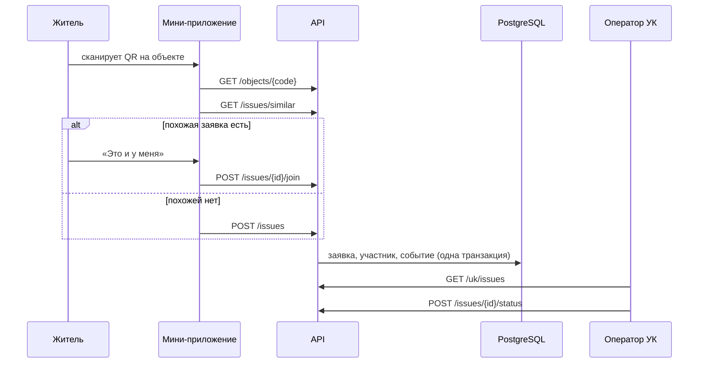

# Архитектура

Сервис состоит из бэкенда на Go, мини-приложения MAX и чат-бота. Бэкенд один: он отдаёт HTTP API мини-приложению, принимает события бота и хранит данные в PostgreSQL.

## Компоненты

| Компонент | Технологии | Назначение |
|---|---|---|
| `backend/` | Go 1.27, Fiber v3, pgx, sqlc, goose | API, бот, бизнес-правила заявок |
| `miniapp/` | Vite, React, TypeScript, MAX UI, MAX Bridge | интерфейс жителя и сотрудника УК |
| PostgreSQL 18 | | дома, заявки, участники, журнал событий |
| Caddy | | HTTPS, раздача мини-приложения, прокси `/api` и `/webhook` |

## Слои бэкенда

```
cmd/api             сборка зависимостей и запуск
internal/domain     правила предметной области, без внешних зависимостей
internal/app        сценарии и интерфейсы хранилища
internal/transport  входящие запросы: HTTP API, события бота
internal/storage    PostgreSQL и клиент MAX Bot API
```

- `domain` ни от чего не зависит.
- `app` зависит только от `domain`.
- `transport` и `storage` зависят от `app` и `domain`.
- Собирает всё вместе только `cmd/api`.

### Домен

- **Заявка (`issue`)** — главный объект. Хранит статус и допустимые переходы, список участников, срок ответа. При каждом изменении записывает событие: создана, присоединился житель, сменился статус.
- **Справочник категорий (`rules`)** — для каждой категории задаёт ответственного, основание и срок в рабочих днях. Для другого региона меняется справочник, а не код.
- **Пользователь (`user`)** — житель или оператор УК, согласие на обработку персональных данных, удаление аккаунта с обезличиванием.
- **Дом (`house`)** — дом, подъезды, объекты общего имущества с QR-кодами, управляющая организация.

### Сценарии

- **Сообщить о проблеме:** категория берётся из объекта с QR-кодом или из выбора жителя. Ответственный — УК дома, срок считается по справочнику в рабочих днях по московскому времени.
- **«Это и у меня»:** житель присоединяется к открытой заявке вместо создания дубля. Повторное присоединение отклоняется.
- **Похожие заявки:** перед созданием новой показываются открытые заявки того же дома и категории за 14 дней.
- **Смена статуса:** доступна только оператору УК, которая отвечает за заявку. Отказ требует причину.
- **Очередь УК:** открытые заявки по сроку, просроченные первыми, затем закрытые.

Изменение заявки выполняется в одной транзакции: блокировка строки, проверка правил, сохранение состояния, новых участников и событий.

## Поток заявки



## Бот

Режим задаётся переменной `BOT_MODE`:

| Режим | Когда | Как работает |
|---|---|---|
| `webhook` | сервер | при старте регистрирует `https://<DOMAIN>/webhook/max`; события приходят POST-запросами |
| `polling` | разработка | бот сам опрашивает `GET /updates` |
| `off` | разработка API | бот не запускается |

Webhook проверяет секрет из заголовка `X-Max-Bot-Api-Secret`, отвечает 200 сразу и обрабатывает событие в фоне. MAX может доставить событие повторно, поэтому ключ каждого события сохраняется в таблице `processed_updates` и повтор пропускается.

Бот отвечает только в личных диалогах и не пишет в групповые чаты.

## Вход

- **Мини-приложение** передаёт строку `initData`. Сервер проверяет подпись HMAC-SHA256 на токене бота и свежесть `auth_date` (не старше часа), затем выдаёт собственный токен сессии на 12 часов.
- **Демо-вход** (`POST /api/v1/auth/demo`) нужен для проверки API без клиента MAX. Включается переменной `DEMO_AUTH_ENABLED=true` только на демо-стенде.

## Данные

- Схема и демонстрационные данные создаются миграциями при старте сервиса (`internal/storage/postgres/migrations`).
- Модельные записи помечены `source = 'model'`, подробности — в [data.md](data.md).
- Соседи видят только число участников заявки, имена и телефоны не раскрываются.
