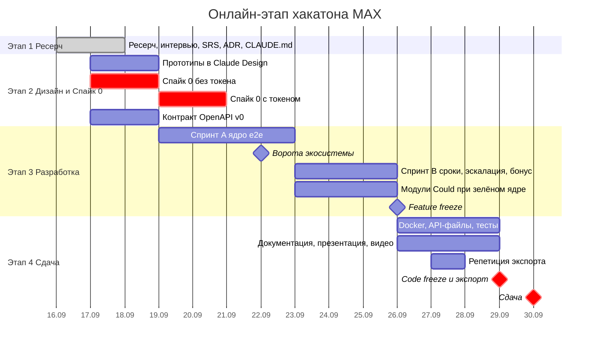

# General Plan v1: 17.09 → 30.09.2026

> **Следующий план — [GEN_V2_PLAN](GEN_V2_PLAN.md).** Строки v1 до 28.09 выполнены раньше срока.

> Точный дедлайн неизвестен → планируем по худшему случаю: **code freeze 29.09 днём**. Токена бота нет → Спайк 0 разделён на две части.
> Вехи и эпики — в [ROADMAP](ROADMAP.md); задачи — в GitHub Issues/Projects.

Связанные документы: [INDEX](INDEX.md) · [SRS](SRS.md) · [ROADMAP](ROADMAP.md) · [risks](research/risks.md) · [judging-criteria](research/judging-criteria.md) · [ADR](adr/README.md)

## План на 23–30.09 (действует, заменяет даты ниже)

Выдан бот `t105_hakaton_max_bot`, дизайн v2 утверждён, кода ещё нет. Модули Could в этот раунд не входят: ворота 22.09 не пройдены. Кто пишет — тот пишет, передача через [HANDOFF](HANDOFF.md).

| День | Результат |
|---|---|
| 23.09 | Каркас репо, ADR-010/011. Caddy-заглушка на VPS → URL мини-приложения на модерацию. Домен `issue` + тесты. Бот в polling отвечает на `/start` |
| 24.09 | Миграции, sqlc, репозитории. Сценарии Report/Join/ChangeStatus/Get/List. HTTP API + auth (initData, demo). `openapi.yaml` v1 |
| 25.09 | Outbox и живая карточка. Диалог бота (простая заявка, гео, `open_app`). Каркас мини-приложения: Home, Issue |
| 26.09 | Report (3 шага) + Duplicate/Join, Consent. УК: очередь + смена статуса со штампом. Сквозная проверка в MAX |
| 27.09 | Сроки и просрочка, метрики УК, шеринг, QR/диплинки, удаление аккаунта, тёмная тема |
| 28.09 | Should по остатку: фото (MinIO), PDF-эскалация, Ollama. Docker ≤ 5 мин, DATA-API.yaml, README, `docs/` |
| 29.09 | Заморозка кода, экспорт в чистый репозиторий, проверка на чистой машине |
| 30.09 | Сдача |

Разделы ниже — исходный план от 17.09, оставлен для истории.

---

## 1. Таймлайн

---

## 2. Этапы

### Этап 1 — Ресерч и решения (16–17.09) ✅
- [x] `docs/` → `hack-docs/`, ресерч, MINDMAP
- [x] Интервью А, Б, В, Г (в plan mode)
- [x] SRS v1.0 и `requirements/*`
- [x] ADR-001…008
- [x] ROADMAP, CLAUDE.md, AGENTS.md
- [ ] **Сегодня:** запрос организаторам по токену бота и точному дедлайну

### Этап 2 — Дизайн, контракт, Спайк 0 (17–20.09)

**Спайк 0 без токена (17–18.09)**
- [ ] Российский VPS (8 vCPU / 16 ГБ, ориентир), домен, DNS, Caddy с TLS
- [ ] Монорепо: `backend/` (go.mod, Fiber v3, каркас слоёв), `miniapp/` (Vite + React + MAX UI), `deploy/compose.yaml` (api, miniapp, postgres, minio, caddy; профиль `llm`)
- [ ] Hello-world мини-приложения по HTTPS; `window.WebApp` подключён
- [ ] Валидатор initData на Go + юнит-тесты на своих подписях (TDD)
- [ ] Ollama на VPS: выбор модели, проверка лицензии, p95 классификации на 30 тестовых описаниях
- [ ] Данные: выбор района Москвы, выгрузка адресного реестра и перечня УК, CSV в `deploy/seed/`
- [ ] Проверка исходящего HTTPS к `platform-api2.max.ru` с сертификатом Минцифры в образе
- [ ] CI: линтеры (golangci-lint, ESLint), тесты, `docker compose build` с замером времени

**Спайк 0 с токеном (как только выдадут)**
- [ ] Webhook `/webhook/max` + секрет; эхо-бот; `PATCH /me/commands`
- [ ] **URL мини-приложения и разрешения бота — сразу на модерацию** (до 48 рабочих часов)
- [ ] Матрица Bridge на iOS/Android/desktop/web: `requestContact`, `shareMaxContent` (mid), `openCodeReader`, `downloadFile`, `input type=file`, `HapticFeedback`
- [ ] Живая карточка: отправка и `PUT /messages` в диалоге

**Параллельно**
- [x] Визуальная система «Адресная табличка» и кликабельный прототип ([ADR-009](adr/009-visual-identity.md), [DESIGN-SYSTEM](design/DESIGN-SYSTEM.md))
- [x] Спецификация своих компонентов ([DESIGN-SYSTEM §4](design/DESIGN-SYSTEM.md))
- [ ] Выбрать название продукта (нужно для наклейки и профиля бота)
- [ ] `api/openapi.yaml` v0 — к утру 19.09, ревью обеих пар
- [ ] Справочник категорий, ответственности и сроков с источниками норм (сверка ПП 416)

### Этап 3 — Разработка (19–26.09)

**Спринт A (19–22.09): ядро e2e** — [ROADMAP M1](ROADMAP.md)
- Пара A «Приём»: вход (initData → сессия), привязка к дому (поиск + геопозиция), диалог в боте, LLM-классификация с откатом, форма мини-приложения, QR и диплинки, согласие
- Пара B «Жизненный цикл»: домен Issue и события, дедупликация «это и у меня», outbox и живая карточка, роль УК (список, смена статуса), демо-вход, seed

**22.09 — ворота экосистемы.** Проверка: основной сценарий e2e на mobile и web. Зелёное → модули Could берутся по одному в Спринте B; красное → весь Спринт B уходит на ядро.

**Спринт B (23–25.09)** — [ROADMAP M2](ROADMAP.md)
- Сроки и просрочка, PDF-эскалация + черновик LLM, дашборд метрик УК, шеринг `shareMaxContent` + запасные пути, деградация на web, удаление аккаунта, полировка UX-состояний
- Модули Could (если ворота открыты): опрос без юридической силы → «Совет дома» → приём в УК → модерация канала

**26.09 — feature freeze.** Документация продукта в `docs/` пишется вместе с фичей (входит в definition of done).

### Этап 4 — Упаковка и сдача (26–30.09) — [ROADMAP M4–M5](ROADMAP.md)
- Docker: сборка ≤ 5 мин (замер в CI), `.env.example`, `.dockerignore`
- `openapi.yaml`, `DATA-API.yaml` (проверки проходят против демо-стенда), тестовые данные
- Тесты: домен (TDD), контрактные, e2e-чек-лист в MAX на 4 клиентах
- README (14 разделов) и `docs/*` — финальная вычитка людьми; `docs/legal/*`
- PDF-презентация (1-й слайд технический) и видео-демо (вау-момент: QR в лифте → заявка за 3 шага)
- 27.09 — репетиция экспорта в чистый репозиторий ([ADR-007](adr/007-submission-packaging.md))
- **29.09 днём:** code freeze → экспорт → проверки ИИ-меток и секретов → commit hash → заморозка стенда
- 30.09 — сдача

---

## 3. Команда и ресурсы

| Кто | Зона |
|---|---|
| Пара A «Приём» (2 фулстека) | бот-диалог, LLM, привязка к дому, форма, QR и диплинки, согласие |
| Пара B «Жизненный цикл» (2 фулстека) | Issue и события, дедупликация, outbox и карточка, роль УК и дашборд, сроки, PDF, шеринг |
| Ротация по дням | DevOps (VPS, CI, Docker), документация продукта `docs/`, презентация |
| Gemini-агенты (5) | гибко, «кто сделает — тот сделает»: генерация по контракту, тесты, черновики текстов; **любой PR с их кодом принимает человек из пары** |
| Claude Code | архитектура и ADR, контракт OpenAPI, декомпозиция задач в Issues, ревью, интеграция, поддержка `hack-docs/INDEX.md` и CLAUDE.md |

Загрузка команды — почти фултайм ([Блок Г](interview/BLOCK-G.md)).

## 4. Ворота качества
1. **Контракт до кода:** изменения `openapi.yaml` — только через PR с ревью обеих пар.
2. **Ревью человеком:** автор или ревьюер из пары понимает и может объяснить каждую строку (п. 9.5).
3. **CI зелёный:** линтеры, тесты, контрактные тесты, сборка ≤ 5 мин.
4. **Ежедневный прогон** основного сценария в MAX (mobile + web) — с момента появления токена.
5. **Definition of Done фичи:** тесты; состояния загрузки, ошибки и «пусто»; раздел в `docs/`; FR отмечены в Issue.
6. **Перед сдачей:** чек-лист [judging-criteria §5](research/judging-criteria.md); экспорт без ИИ-меток; сборка на чистой машине.

## 5. Ритм
- 10:00 — синк 15 минут: вчера, сегодня, блокеры.
- 20:00 — слияние в `main` и прогон сценария.
- Решение принято → ADR; новая заметка → строка в [INDEX](INDEX.md).
