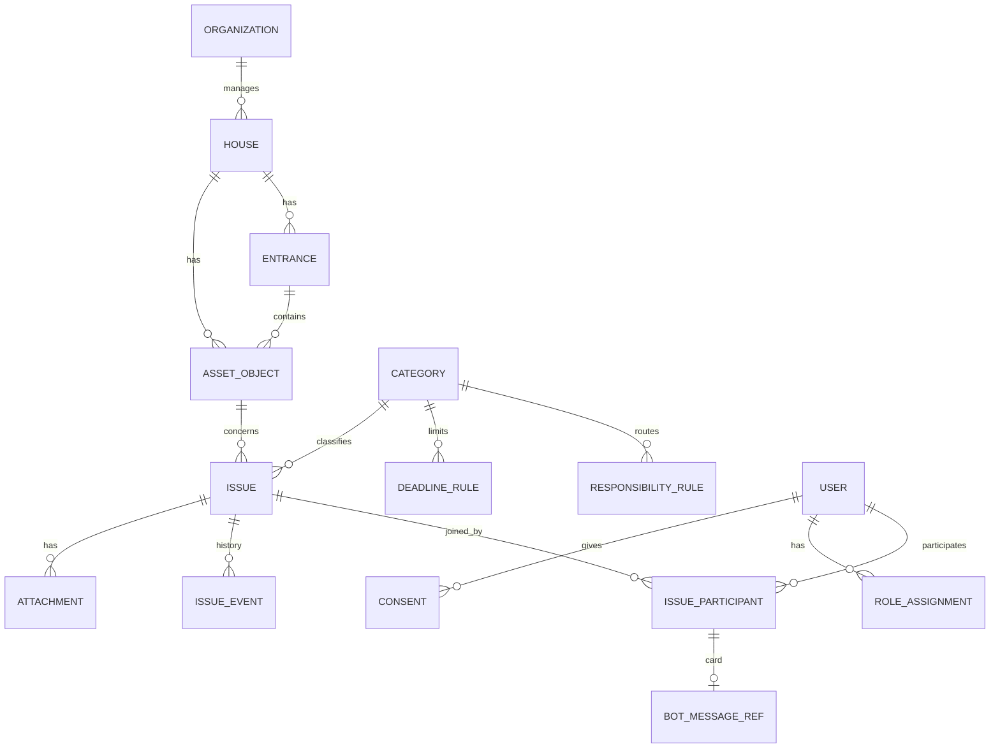

# Модель данных и источники

Решения: [ADR-002](../adr/002-product-scope.md) (Москва, один район), [ADR-003](../adr/003-backend-architecture.md) (PostgreSQL, MinIO), [ADR-004](../adr/004-auth-and-roles.md) (роли), [Блок В](../interview/BLOCK-V.md).
Связанные: [SRS](../SRS.md) · [legal-framework](../research/legal-framework.md) · [nfr](nfr.md)

---

## 1. Сущности (логическая модель)

| Сущность | Ключевые поля | Происхождение |
|---|---|---|
| `Organization` | id, type (uk, tsj, rso, regoperator, capital_repair_fund, gji), name, inn, phones (office, dispatcher, emergency), schedule, source, source_date | открытые данные / модель |
| `House` | id, gar_guid / unom, address, district, year_built, floors, entrances_count, organization_id, source, source_date | открытые данные |
| `Entrance` | id, house_id, number | открытые данные / модель |
| `AssetObject` | id, house_id, entrance_id?, kind (elevator, entrance_lighting, roof, riser, yard, intercom…), label, qr_code | модель (для QR-демо) |
| `Category` | code, title, kind_scope, is_common_property | справочник команды |
| `ResponsibilityRule` | category_code, org_type, basis_text, basis_ref, region | справочник с источниками норм |
| `DeadlineRule` | category_code, reaction_hours / business_days, basis_ref | справочник (ПП 416; сверить) |
| `Issue` | id, public_no, house_id, object_id, category_code, status, responsible_org_id, deadline_at, created_by, description, urgency, llm_suggested (bool), created_at | данные пользователей |
| `IssueParticipant` | issue_id, user_id, joined_at, phone_shared (bool), anonymized (bool) | данные пользователей |
| `IssueEvent` | issue_id, type (created, joined, status_changed, comment, overdue, escalated), actor_id, payload, at | система |
| `Attachment` | issue_id, s3_key, mime, size, uploaded_by | пользователи (MinIO) |
| `User` | id, max_user_id, first_name, house_id?, entrance_id?, phone?, deleted_at | MAX + пользователь |
| `RoleAssignment` | user_id, role, organization_id? | seed / админ |
| `Consent` | user_id, doc_version, accepted_at | пользователь |
| `BotMessageRef` | participant (issue_id, user_id), chat_id, mid | система |
| `ProcessedUpdate` | update_key (уникальный), received_at | система (дедупликация) |
| `OutboxMessage` | id, chat_id, kind (send, edit), payload, attempts, next_attempt_at, status | система |

**Метрики** (NFR-10) считаются из `IssueEvent`: время до реакции = первый `status_changed` → «принято» минус `created`; дубли = число `joined` на проблему; просрочка = `overdue` / всё.

## 2. Источники данных (Москва, один район)

| Данные | Источник | Статус | Как используем |
|---|---|---|---|
| Адреса зданий | [Адресный реестр объектов недвижимости г. Москвы — data.mos.ru, набор 60562](https://data.mos.ru/opendata/60562) (МосгорБТИ) | проверить поля и лицензию | срез района → `House`, поиск адреса |
| УК и ТСЖ | [Перечень управляющих компаний и ТСЖ — data.mos.ru](https://data.mos.ru/opendata/7702051094-perechen-upravlyayushchih-kompaniy-i-tovarishchestv-sobstvennikov-jilya) | проверить поля | `Organization`, связь с домом |
| Сведения о доме (год, этажность, УК) | [dom.mos.ru](https://dom.mos.ru/), открытая часть [ГИС ЖКХ](https://dom.gosuslugi.ru/) | проверить условия использования | обогащение `House` вручную или выгрузкой |
| ГАР (ФИАС) | [ФНС, fias.nalog.ru](https://fias.nalog.ru/Updates) | резерв | GUID адресов, если нужен общероссийский ключ |
| ГЖИ Москвы | официальный сайт Мосжилинспекции | уточнить реквизиты | реквизиты в PDF-эскалации |
| Нормы и сроки | ПП 416, ПП 354, 59-ФЗ ([legal-framework](../research/legal-framework.md)) | часть — «сверить» | `ResponsibilityRule`, `DeadlineRule` с `basis_ref` |
| Объекты (лифты, подъезды), жители, заявки | синтетика | модель | seed, маркировка «модельные данные» |

Выбор района — в Спайке 0: панельная застройка 70–90-х, 20–50 домов в срезе.

## 3. Маркировка происхождения
Каждый показанный пользователю факт имеет тип:
- **официальный** — `source` и `source_date`;
- **расчёт системы** — сроки и метрики;
- **рекомендация** — подсказка LLM, «черновик, проверьте»;
- **модельные данные** — пометка в интерфейсе на демо-стенде и в `docs/data.md`.

## 4. Seed и тестовые данные
- **Детерминированный генератор на Go** (`backend/cmd/seed`, фиксированный random seed):
  - импорт среза района из CSV/JSON в `deploy/seed/`;
  - объекты с QR-кодами;
  - 5 тестовых пользователей по ролям;
  - 30–60 синтетических заявок с событиями за 30 дней для дашборда.
- **Демо-роли** ([ADR-004](../adr/004-auth-and-roles.md)): `resident_demo_1`, `resident_demo_2`, `uk_operator_demo` (УК домов района), `chairman_demo`, `admin_demo`.
- **QR-коды** для демо генерируются скриптом в PDF для печати (`o_<code>`).
- Seed запускается при старте compose; сброс демо-данных — отдельная команда (фиксируется в README на этапе 4).
- Тестовые данные для жюри: JSON-выгрузка сценариев проверки и ожидаемых ответов рядом с `DATA-API.yaml`.

## 5. Хранение и сроки
- Обращения и события хранятся не меньше срока проекта. В пилоте — 3 года по аналогии с ПП 416 (решение пилота).
- При удалении аккаунта ПДн удаляются, участия обезличиваются (SEC-07).
- Фото в MinIO удаляются вместе с заявкой по политике хранения (задаётся в пилоте).
