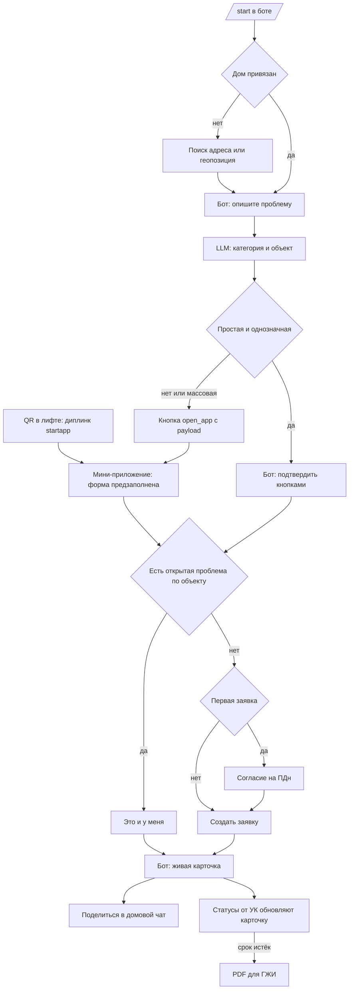

# UX-сценарии: бот и мини-приложение

Решения: [Блок Б](../interview/BLOCK-B.md), [ADR-002](../adr/002-product-scope.md), [ADR-008](../adr/008-llm-self-hosted.md). Возможности платформы: [max-platform-capabilities](../research/max-platform-capabilities.md).
Связанные: [user-stories](user-stories.md) · [SRS](../SRS.md) · [platform-bonus](../research/platform-bonus.md)

---

## 1. Принципы
- **Два равнозначных входа:** QR/диплинк → мини-приложение и `/start` → бот.
- **Бот** — простые сценарии диалогом, статусы, уведомления. **Мини-приложение** — формы, списки, фото, роль УК, PDF ([Case.md](../Case.md), «сценарии работы платформы»).
- **Путь до заявки ≤ 3 шагов**; на каждом экране есть состояния загрузки, успеха, ошибки и «пусто».
- **Тон:** точные нормы и сроки простыми словами; «вы», без фамильярности и канцелярита. Пример: «Заявка принята. Отвечает УК „…“. Срок ответа: до 20 сентября, по справочнику сроков». Правила текстов — [DESIGN-SYSTEM §6](../design/DESIGN-SYSTEM.md).

## 2. Основные потоки



### 2.1 Простой диалог в боте
1. Житель пишет «не горит свет на 5 этаже» (или нажимает «Сообщить о проблеме»).
2. Если дом не привязан: «Где вы живёте?» → кнопки «Отправить геопозицию» (`request_geo_location`) и «Найти по адресу» (`open_app` на экран поиска).
3. LLM или правила определяют категорию; бот показывает «Освещение подъезда · подъезд 2 · отвечает УК „…“ · срок …» с кнопками «Верно» / «Изменить» / «Добавить фото» (фото — сообщением в бот).
4. Если уже есть открытая проблема: «Об этом уже сообщили 4 соседа» → «Это и у меня» / «Это другое».
5. Первая заявка: короткое согласие со ссылкой на документы и кнопкой «Согласен».
6. Живая карточка.

### 2.2 Сложный или массовый путь
Житель пишет развёрнуто (например, «третий день нет горячей воды во всём подъезде, в УК не дозвониться»). LLM размечает категорию, масштаб и срочность → бот: «Откройте форму, чтобы проверить и добавить детали» → `open_app` с payload → форма предзаполнена → проверка, фото → подтверждение.

### 2.3 QR-вход (вау-момент)
Диплинк `https://max.ru/<bot>?startapp=o_<objectCode>`: дом, подъезд и объект известны сразу. Экран «Что случилось?» показывает быстрые чипы типичных поломок объекта и поле для текста.

### 2.4 Сотрудник УК
Роль `uk_operator` → хаб «Мои дома»: вкладка-переключатель «Проблемы / Метрики» внутри экрана (свой компонент). Список отсортирован по просрочке и масштабу → карточка проблемы → «Сменить статус» (BottomSheet с комментарием).

## 3. Карта экранов мини-приложения (хаб + стек)

| Экран | Роль | Содержимое | Возможности MAX |
|---|---|---|---|
| Хаб «Мой дом» | житель | адрес, открытые проблемы дома (CellList), «Мои заявки», кнопка «Сообщить о проблеме», контакты УК и АДС | `start_param`, BackButton скрыт |
| Поиск дома | житель | SearchInput с подсказками, выбор подъезда | — |
| Новая проблема: описание | житель | чипы, Textarea, «Продолжить» | `enableClosingConfirmation` |
| Проверка формы | житель | категория (Select), объект, срочность, фото (PhotoPicker, до 5), подсказка «найдено похожее» | `requestContact` (по желанию), BackButton |
| Согласие | житель | краткий текст, ссылки на политику и соглашение | — |
| Заявка принята | житель | номер, ответственный, срок, «Поделиться» | `shareMaxContent`, HapticFeedback |
| Карточка проблемы | все | статус (StatusTimeline), срок, затронуто, фото, «Это и у меня», «Поделиться», «PDF для ГЖИ» при просрочке | `downloadFile`, `shareMaxContent` |
| Мои заявки | житель | список участий | — |
| Профиль | все | дом, телефон, документы, удалить аккаунт | — |
| УК: проблемы | uk_operator | фильтры, список с сортировкой | — |
| УК: метрики | uk_operator | MetricTile ×3, период | — |
| УК: смена статуса | uk_operator | BottomSheet: статус, комментарий | HapticFeedback |

**Свои компоненты** (в MAX UI нет): BottomSheet, SegmentedSwitch (переключатель вкладок внутри экрана), Select, Toast, PhotoPicker, StatusTimeline, MetricTile, EmptyState, ErrorState.

## 4. Живая карточка (сообщение бота)

Актуальный шаблон и правила — [DESIGN-SYSTEM §5](../design/DESIGN-SYSTEM.md) (без эмодзи, markdown):
```
**Заявка № 0142**
Лифт не работает, подъезд 2

Статус: принята УК «…»
Срок: до 19 сентября
Сообщили соседи: 13
```
Кнопки: `[Открыть заявку]` (open_app, payload `i_<id>`) · `[Поделиться]` (open_app на экран шеринга) · `[Это и у меня]` (только в варианте для шеринга и соседей).
Правила:
- при смене статуса — `PUT /messages` у каждого участника;
- новое сообщение приходит только при «Выполнено» (с просьбой подтвердить) и при просрочке;
- формат — markdown.

## 5. Команды бота (`PATCH /me/commands`)
| Команда | Действие |
|---|---|
| `/start` | приветствие, ценность в одной фразе, кнопки «Сообщить о проблеме» и «Открыть приложение» |
| `/new` | сообщить о проблеме |
| `/my` | мои заявки (список карточек) |
| `/house` | мой дом: контакты УК и АДС, открытые проблемы |
| `/help` | как это работает, документы, поддержка |

## 6. Согласие и документы
- Показываются перед первой заявкой или присоединением; просмотр проблем дома доступен без согласия.
- Ссылки на политику ПДн и пользовательское соглашение (`docs/legal/`), кнопка «Согласен». Отметка хранится с датой и версией документа.

## 7. Деградация на web и desktop
Матрица и запасные пути — [platform-bonus §4](../research/platform-bonus.md). В интерфейсе недоступные действия не показываются, а заменяются рабочей альтернативой; ошибок нет.

## 8. Дизайн
Визуальная система «Адресная табличка» принята ([ADR-009](../adr/009-visual-identity.md)):
- [DESIGN-SYSTEM](../design/DESIGN-SYSTEM.md) — токены, компоненты, тексты;
- [tokens.css](../design/tokens.css) — токены для кода;
- [кликабельный прототип](../design/prototype/index.html) — хаб, три шага заявки, отправка, карточка, просрочка, состояния, УК (список, метрики, смена статуса), бот, QR-наклейка.

Figma-кит MAX UI — референс нативных компонентов.
