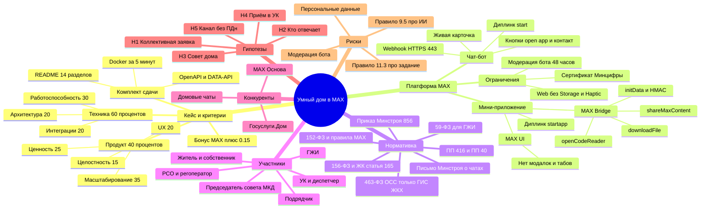
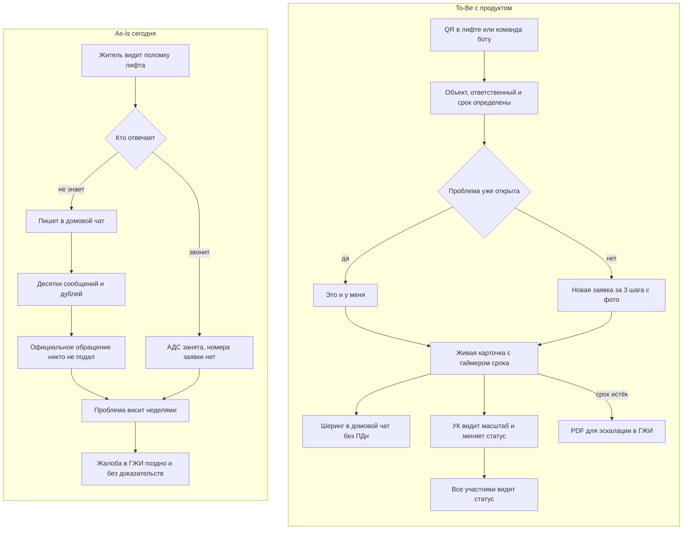
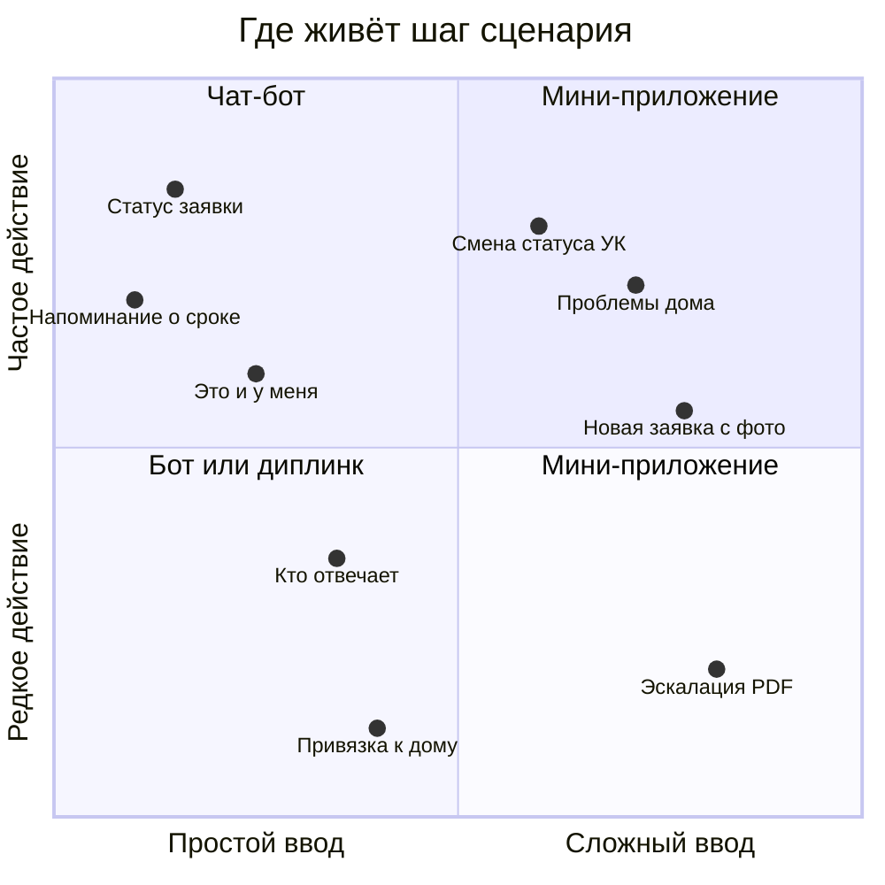
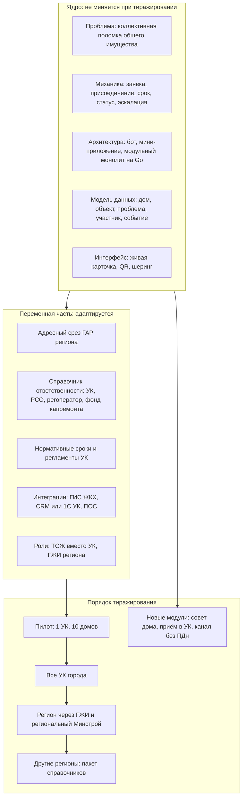
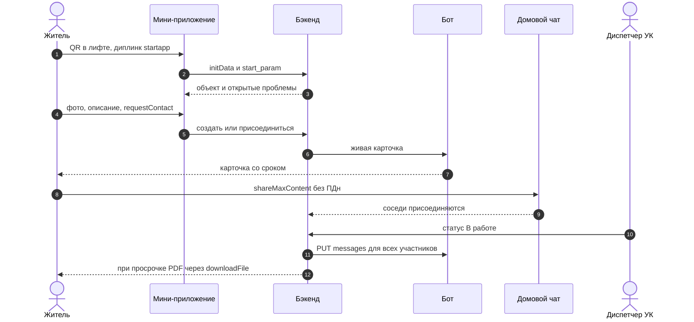

# Интеллект-карта: «Умный дом» в MAX

Хаб исследования. Детали — в атомарных заметках:
[max-platform-capabilities](max-platform-capabilities.md) · [legal-framework](legal-framework.md) · [competitors](competitors.md) · [problems](problems.md) · [product-hypotheses](product-hypotheses.md) · [platform-bonus](platform-bonus.md) · [judging-criteria](judging-criteria.md) · [risks](risks.md)

> Статус: **фокус принят** (17.09) — ядро H1 + H2 + шеринг из H5, пилот Москва, модель B2G → SaaS ([ADR-002](../adr/002-product-scope.md)). **To-Be из §2 собрано в коде к 24.09** (см. §7), дальше — [GEN_V2_PLAN](../GEN_V2_PLAN.md).

---

## 1. Карта домена

**Разбор.** В домене три силы:
1. **Регулятор уже перенёс канал в MAX.** С 01.09.2026 УК обязаны взаимодействовать через MAX; официальные обращения идут через бот ГИС ЖКХ; домовые чаты принадлежат ГЖИ ([legal-framework](legal-framework.md)).
2. **Государство уже закрыло индивидуальные сценарии**: заявка, показания, оплата, чат ([competitors](competitors.md)).
3. **Коллективный разрыв остаётся**: одна поломка общего имущества порождает десятки сообщений в чате, но ни одного доказательного обращения, а сроки и ответственность непрозрачны ([problems](problems.md)).

Отсюда рекомендуемый фокус — H1 ([product-hypotheses](product-hypotheses.md)).

---

## 2. As-Is → To-Be

### По ролям

| Роль | As-Is: что болит | To-Be: что меняется | Метрика |
|---|---|---|---|
| Житель | не знает, кто отвечает; нет номера и срока; жалоба в ГЖИ сложна ([P1–P4](problems.md)) | за 3 шага: ответственный, срок, статус; «это и у меня» вместо дубля; PDF для эскалации | время до подачи; доля завершивших сценарий |
| Председатель совета МКД | разрозненные жалобы без доказательств ([P8](problems.md)) | реестр проблем дома с фото, датами и числом затронутых | число доказательных обращений |
| Диспетчер УК | дубли, неструктурированные сообщения, звонки «когда почините» ([P12–P14](problems.md)) | одна заявка на проблему с точным объектом и масштабом; статус меняется одной кнопкой и сам доходит до участников | дублей на проблему; повторных звонков |
| Подрядчик | нет точного объекта и фото ([P15–P16](problems.md)) | объект из QR, фото, отметка выполнения с фото | повторных выездов |
| ГЖИ | поздние жалобы без доказательств ([P17](problems.md)) | эскалация с хронологией и нормами (Scale: кабинет ГЖИ) | доля обоснованных жалоб |

---

## 3. Матрица «чат-бот или мини-приложение»

Правило из кейса ([Case.md](../Case.md), «Сценарии работы платформы MAX»): бот — последовательные вопросы, выбор из немногих опций, статус, уведомления, короткие регулярные действия; мини-приложение — сложные формы, списки и каталоги, сравнение, возврат к данным, несколько связанных элементов.

| Шаг сценария | Канал | Возможности MAX | Почему |
|---|---|---|---|
| Первый вход и привязка к дому | диплинк `startapp`/`start` → мини-приложение | `start_param`, `initData` | адрес не вводится вручную |
| «Кто отвечает» и выбор категории | мини-приложение (быстрый вариант — кнопки бота) | `callback` | до 6 опций подходят для бота, дерево — для мини-приложения |
| Новая заявка: фото, объект, описание | мини-приложение | `openCodeReader`, `requestContact`, `enableClosingConfirmation`, `BackButton` | сложная форма |
| «Это и у меня» | кнопка в карточке → мини-приложение | `open_app` с payload | одно касание |
| Живая карточка: статус и срок | бот | `inline_keyboard`, `PUT /messages` | статус и уведомления — сильная сторона бота |
| Шеринг в домовой чат | мини-приложение → чат | `shareMaxContent` | виральность без ПДн |
| Список проблем дома, фильтры, история | мини-приложение | MAX UI `CellList` | список и возврат к данным |
| Смена статуса (роль УК) | мини-приложение (режим роли) + кнопки бота | RBAC по `user.id` | частое действие сотрудника |
| Эскалация: PDF | мини-приложение | `downloadFile` | документ |
| Геопозиция проблемы во дворе | бот | `request_geo_location` | в Bridge геолокации нет |

---

## 4. Ядро и переменная часть (масштабирование — 35% продуктовой оценки)

**Разбор.**
- **Ядро** описано в терминах, одинаковых для любого МКД в России: общее имущество, ответственный, нормативный срок, статус.
- **Переменная часть** вынесена в данные и адаптеры (справочники ответственности и сроков, ГАР-срез, адаптеры ГИС ЖКХ/CRM), а не в код. Это главный технический аргумент масштабируемости: новый регион — это пакет данных и конфигурация, а не форк.
- **Риски масштабирования:** доступ к API ГИС ЖКХ (нужна организация-оператор ИС), согласие УК встраиваться в процесс, §1.5 требований MAX (уведомления), ПДн ([risks](risks.md)).

---

## 5. Сквозная цепочка платформенного бонуса

Подробности, условия бонуса и деградация на web — в [platform-bonus](platform-bonus.md).

---

## 6. Что решено на интервью (17.09)
1. **Фокус и сегмент** — ядро H1 + H2 + шеринг; жители панельного фонда 70–90-х; пилот Москва; экосистема за воротами 22.09 → [Блок А](../interview/BLOCK-A.md), [ADR-002](../adr/002-product-scope.md).
2. **UX** — бот и мини-приложение равнозначны; простое решается в боте, сложное — через LLM и форму; хаб «Мой дом»; УК — список + дашборд → [Блок Б](../interview/BLOCK-B.md), [ux-flows](../requirements/ux-flows.md).
3. **Данные и стек** — открытые данные района Москвы; Go + Fiber v3 + PostgreSQL + MinIO (сначала заменён томом, [ADR-015](../adr/015-photo-storage.md), затем возвращён, [ADR-018](../adr/018-photos-in-minio.md)); React JS (позже TypeScript, [ADR-011](../adr/011-miniapp-typescript.md)) + MAX UI; Ollama → [Блок В](../interview/BLOCK-V.md), [ADR-003](../adr/003-backend-architecture.md), [ADR-008](../adr/008-llm-self-hosted.md).
4. **Команда** — фулстек-пары; GitHub Issues + PR + CI; сдача из чистого репозитория → [Блок Г](../interview/BLOCK-G.md), [ADR-007](../adr/007-submission-packaging.md).

---

## 7. To-Be в коде (24.09)
| Шаг To-Be из §2 | Состояние |
|---|---|
| QR в лифте или команда боту | есть: наклейки с QR (`startapp=o_<код>`), диалог бота, геопозиция |
| Объект, ответственный и срок определены | есть: справочник `rules`, подсказка категории (правила + Ollama) |
| «Это и у меня» | есть: форма, карточка, бот |
| Новая заявка за 3 шага с фото | есть: форма в 3 шага, фото без EXIF |
| Живая карточка с таймером срока | есть: карточка в боте редактируется, шкала срока в мини-приложении |
| Шеринг в домовой чат без ПДн | есть: `shareMaxContent`, в браузере ссылка `max.ru/:share` |
| УК видит масштаб и меняет статус | есть: очередь по срочности, метрики УК |
| PDF для эскалации в ГЖИ | есть: черновик обращения по подписанной ссылке |
| Роли председателя совета и района, проверка ремонта жителями | в работе по [GEN_V2_PLAN](../GEN_V2_PLAN.md) |
| `requestContact` из цепочки бонуса (§5) | в работе по [GEN_V2_PLAN](../GEN_V2_PLAN.md) |
