# Платформенный бонус MAX (+0.15)

Связанные заметки: [max-platform-capabilities](max-platform-capabilities.md) · [product-hypotheses](product-hypotheses.md) · [judging-criteria](judging-criteria.md) · [risks](risks.md)

## 1. Условия (из [Case.md](../Case.md), критерии онлайн-этапа)
Бонус начисляется **только целиком** (0 или 0.15) и **только в онлайн-этапе**. Все условия обязательны:
1. Основной пользовательский сценарий полностью работает и доступен для проверки.
2. Использована возможность MAX **сверх минимальных требований** задания.
3. Эта возможность **создаёт пользовательскую ценность**.
4. Она **органично встроена** в продукт и **работает от начала до результата**.
5. Она **описана в материалах** (README, документация, презентация).

Не является основанием: собственное API, большое число функций, базовые обязательные возможности.

**Минимум задания** (бонусом не считается): чат-бот, подключённое к нему мини-приложение, текстовые сообщения и кнопки.

## 2. Сквозная цепочка (кандидат, привязан к H1)

```mermaid
sequenceDiagram
    autonumber
    actor R as Житель
    participant QR as QR в подъезде
    participant MA as Мини-приложение
    participant BE as Бэкенд
    participant BOT as Бот MAX
    participant HC as Домовой чат
    actor N as Сосед
    actor UK as Диспетчер УК
    R->>QR: сканирует камерой телефона
    QR->>MA: max.ru/bot?startapp=h12_o3
    MA->>BE: initData + start_param
    BE-->>MA: дом, подъезд, объект, открытые проблемы
    MA->>MA: requestContact с проверкой hash
    R->>MA: фото и описание
    MA->>BE: создать или присоединиться
    BE->>BOT: POST /messages живая карточка
    BOT-->>R: карточка с кнопками и сроком
    R->>MA: поделиться в чат дома
    MA->>HC: shareMaxContent mid и CHAT
    N->>MA: открывает карточку по диплинку
    MA->>BE: присоединиться
    UK->>BE: статус В работе
    BE->>BOT: PUT /messages обновить карточки
    BOT-->>R: карточка обновлена
    BOT-->>N: карточка обновлена
    BE-->>MA: при просрочке пакет эскалации
    R->>MA: downloadFile PDF для ГЖИ
```

## 3. Что используем и зачем

| Возможность MAX | Ценность для пользователя | Источник |
|---|---|---|
| Диплинк `startapp` из QR-наклейки | ноль ручного ввода адреса: дом, подъезд и объект известны сразу | [webapps/introduction.md](../dev-max/docs/webapps/introduction.md) |
| `openCodeReader` | сканирование QR объекта изнутри приложения | [webapps/bridge.md](../dev-max/docs/webapps/bridge.md) |
| `requestContact` + HMAC | проверенный телефон для связи мастера без ручного ввода | [webapps/bridge.md](../dev-max/docs/webapps/bridge.md) |
| «Живая карточка» (`inline_keyboard` + `PUT /messages`) | статус и срок обновляются в одном сообщении, чат не засоряется | [PUT/messages](../dev-max/docs-api/methods/PUT/messages/index.md) |
| `shareMaxContent({mid, chatType})` | карточка без ПДн уходит в домовой чат, соседи присоединяются, а не дублируют | [webapps/bridge.md](../dev-max/docs/webapps/bridge.md) |
| Диплинк `start` для бота | переход из карточки в диалог с ботом с контекстом проблемы | [chatbots/bots-coding/prepare.md](../dev-max/docs/chatbots/bots-coding/prepare.md) |
| `downloadFile` | PDF для эскалации в ГЖИ одним нажатием | [webapps/bridge.md](../dev-max/docs/webapps/bridge.md) |
| `request_geo_location` (бот) | фиксация места для проблем во дворе | [docs-api/index.md](../dev-max/docs-api/index.md) |
| `enableClosingConfirmation`, `BackButton`, `HapticFeedback` | нативное поведение, данные формы не теряются | [webapps/bridge.md](../dev-max/docs/webapps/bridge.md) |
| `PATCH /me/commands` | меню команд бота | [PATCH/me/commands.md](../dev-max/docs-api/methods/PATCH/me/commands.md) |
| Резерв: бот-админ в домовом чате (pin, живая карточка) или бот-модератор комментариев канала | закреп актуальных проблем; фильтр ПДн | [POST/chats/-chatId-/members/admins.md](../dev-max/docs-api/methods/POST/chats/-chatId-/members/admins.md), [POST/messages/-messageId-/comments.md](../dev-max/docs-api/methods/POST/messages/-messageId-/comments.md) |

## 4. Деградация на web и desktop (функциональность обязана работать в обеих версиях)
| Возможность | Если недоступно |
|---|---|
| Сканирование QR камерой телефона | в web: вход через бот → выбор дома из списка; `openCodeReader(true)` позволяет выбрать файл |
| `HapticFeedback` | визуальный toast |
| `shareContent` | `shareMaxContent` или диплинк `:share?text=` |
| `DeviceStorage` | черновик на сервере |
| `shareMaxContent`, `requestContact`, `openCodeReader` на web | **проверить в Спайке 0**; запасной путь — ссылка-диплинк и ручной ввод телефона |

## 5. Как подать жюри
- В README и презентации — отдельный раздел «Возможности MAX в продукте»: таблица «возможность → зачем → где в сценарии», скриншоты и 30-секундный фрагмент видео.
- Шаг проверки в пошаговом сценарии для проверяющего: «откройте ссылку `max.ru/<bot>?startapp=demo_house_1` — дом и подъезд подставятся автоматически».

## 6. Риски
- Работу `shareMaxContent` с `mid` и `requestContact` в web-клиенте нужно подтвердить экспериментом.
- Добавление бота в группу выключено по умолчанию, а включение требует модерации → резервный вариант с ботом-админом включаем заранее или отказываемся от него.
- Уведомления об обновлении карточки могут попасть под §1.5 требований MAX → обновляем только сообщения пользователей, которые сами участвуют в заявке ([legal-framework](legal-framework.md)).
